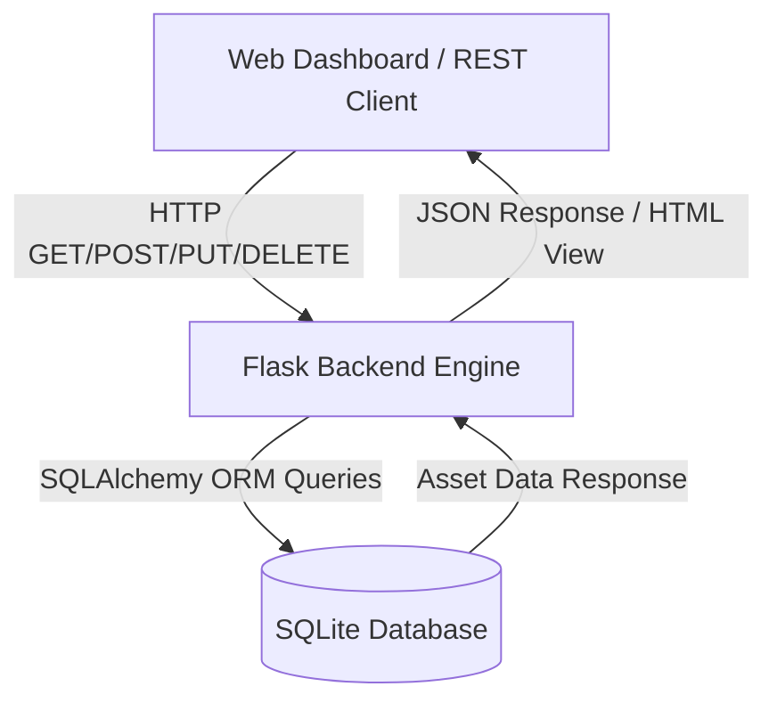

# Enterprise IT Asset Management (ITAM) Tracker & REST API


## 📌 Project Overview
The **IT Asset Management (ITAM) Tracker** is a full-stack, data-driven web application built with Python, Flask, SQLAlchemy, and SQLite. It provides IT departments with a centralized platform to manage hardware lifecycles, assign devices to employees, track network IP addresses (IPAM), and perform automated CRUD operations via a RESTful API and web dashboard.

### Key Features
* **RESTful API Endpoints:** Standardized HTTP routes (`GET`, `POST`, `PUT`, `DELETE`) serving structured JSON data for integration with external IT workflows.
* **Relational Database Management:** Configured with SQLAlchemy ORM to manage hardware schema fields (`device_name`, `category`, `assigned_user`, `status`, `ip_address`).
* **Dynamic Web Dashboard:** Interactive frontend built with JavaScript `fetch()` calls to handle real-time inventory updates without full page reloads.
* **IPAM Integration:** Tracks network IP assignments to prevent IP conflicts and streamline security incident tracing.

---

## 📸 Project Showcase

### Dynamic Web Dashboard & Inventory Management


---

## 🏗 System Architecture & Workflow



---

## 🔌 API Endpoints Reference

| HTTP Method | Route | Description | Request Body Example |
| :--- | :--- | :--- | :--- |
| **GET** | `/api/assets` | Retrieve all hardware assets | None |
| **POST** | `/api/assets` | Provision a new IT asset | `{"device_name": "MacBook Pro", "category": "Laptop", "assigned_user": "Annrose Akande", "status": "In Use", "ip_address": "192.168.1.105"}` |
| **PUT** | `/api/assets/<id>` | Update an existing asset status/user | `{"status": "In Repair", "assigned_user": "Unassigned"}` |
| **DELETE** | `/api/assets/<id>` | Decommission and remove an asset | None |

---

## ⚙️ Setup & Execution Instructions

### Prerequisites
* Python 3.8+ installed

### Installation
1. Clone the repository:
   ```bash
   git clone [https://github.com/your-username/Helpdesk-Asset-Tracker.git](https://github.com/your-username/Helpdesk-Asset-Tracker.git)
   cd Helpdesk-Asset-Tracker
   ```

2. Set up a virtual environment and install dependencies:
   ```bash
   python -m venv venv
   # On Windows:
   venv\Scripts\activate
   # On macOS/Linux:
   source venv/bin/activate

   pip install Flask Flask-SQLAlchemy
   ```

3. Run the application:
   ```bash
   python app.py
   ```

4. Open `http://127.0.0.1:5000/` in your browser to access the dashboard.

---

## 🚀 Skills & Concepts Demonstrated
* **Software Engineering:** Python Flask routing, Object-Relational Mapping (ORM), MVC design pattern.
* **Database & REST API Design:** Designing relational database tables and JSON API response structures.
* **IT Operations & IPAM:** Asset lifecycle management, hardware accountability, and IP address logging for incident triage.

---

## 📄 License
This repository is open-source under the [MIT License](LICENSE).
